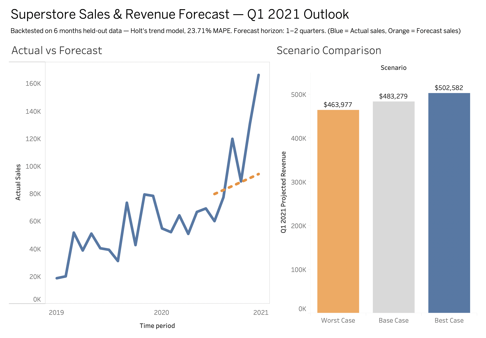

# Sales & Revenue Forecasting Model

A Superstore retailer needs a Q1 2021 revenue forecast for leadership planning. This project builds and backtests a forecasting model, then translates it into a best/base/worst scenario range business stakeholders can act on.

**Live interactive dashboard:** https://public.tableau.com/app/profile/rohith.sribhashyam2941/viz/SuperstoreSalesForecast_17873157885960/SalesRevenueForecastExecutiveSummary



---

## Skills demonstrated

SQL joins & aggregation (DuckDB) · Data cleaning and schema recovery from a messy export · Excel scenario modelling (Scenario Manager, What-If Analysis) · Time-series backtesting and model comparison (naive seasonal, linear regression, exponential smoothing) · Honest handling of a data-volume constraint that blocked a planned model · Tableau dashboard design and publishing

---

## Dataset

[Kaggle: Superstore Dataset](https://www.kaggle.com/datasets/vivek468/superstore-dataset-final) — US retail order-line transactions.

**Honest limitations of this specific file, found during setup:**
- Spans **January 2019 – December 2020 (24 months)**, not the four years some Superstore mirrors contain. This directly shaped the modelling approach below.
- Missing a `Discount` column and `Postal Code`, present in other versions of this dataset.
- Contains a corrupted `Row ID` column header (`Row ID+06G3A1:R6`) from the original export, requiring a rename before use.
- Includes two extra columns, `Returns` and `Payment Mode`, plus two unexplained columns (`ind1`, `ind2`) that appear to be export artefacts and were excluded from analysis.
- 5,901 order lines across 3,003 distinct orders — confirmed genuine one-to-many structure (multiple products per order), which is what makes the SQL split below legitimate normalisation rather than manufactured tables.

## What I found

**Model comparison** (backtested on the final 6 months, trained on the preceding 18):

| Model | MAPE | RMSE |
|---|---|---|
| Naive seasonal (same month last year) | 46.22% | 53,574 |
| Linear trend | 25.77% | 42,702 |
| **Holt's trend (winner)** | **23.71%** | **37,268** |

The naive baseline failed because the business grew substantially year-over-year — "repeat last year's number" is a weak strategy on a fast-growing series. A true seasonal model (Holt-Winters) could not be fit: statsmodels requires two full seasonal cycles (24 months) to initialise seasonal components, and only 18 months were available for training. Holt's trend-only method was used instead, and its performance was close to simple linear regression — suggesting the visible seasonal spikes (Sep/Nov/Dec) couldn't be reliably separated from trend on this much history.

**Q1 2021 scenario forecast** (Excel, Scenario Manager, base growth rate 25.19% derived from 7 quarter-over-quarter observations):

| Scenario | Projected Revenue |
|---|---|
| Worst Case | $463,977 |
| Base Case | $483,279 |
| Best Case | $502,582 |

## Recommendation

Plan Q1 2021 budgets against the **Base Case ($483K)**, with the **Worst Case ($464K)** held as a contingency floor for staffing or inventory commitments that are expensive to reverse.

**Forecast horizon: one to two quarters, not a year.** With only two years of history and a single December-to-December comparison observed, a confident 12-month seasonal forecast is not defensible from this data. This limitation should be revisited once another full year of data is available.

## Methodology

- **SQL (DuckDB):** Split the flat export into `orders`, `order_lines`, and `products` tables and joined them to aggregate to monthly revenue by category — a genuine multi-table JOIN, since the source data has real repeating order-line structure.
- **Excel:** Built a quarterly scenario model with an Assumptions sheet driving Base/Best/Worst projections via formula, formalised through Scenario Manager (What-If Analysis).
- **Python (pandas, statsmodels, scikit-learn):** Backtested three forecasting models on a held-out 6-month test period, using a shortened 18-month training window to reflect the dataset's actual 24-month span rather than a train/test split assumed from a longer history.
- **Tableau:** Built an executive dashboard combining an actual-vs-forecast time series (test period visually distinguished by a dashed line) with the scenario comparison, published to Tableau Public.

## Repo structure

```
README.md               this file
images/dashboard.png    dashboard screenshot shown above
notebook/                SQL prep (01_sql_prep.ipynb) and forecasting (02_forecast.ipynb), with output saved
excel/                   scenario model workbook (superstore_scenario_model.xlsx)
```

Raw data is not included here — see the Kaggle link in the Dataset section above. The live Tableau dashboard (linked at the top) is the interactive version; no local `.twbx` file is uploaded.
